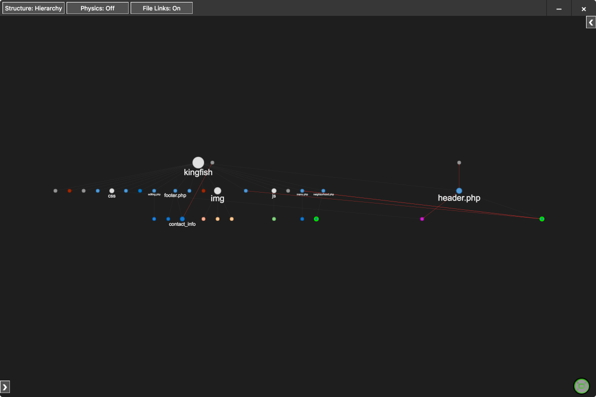

# Postal

The Postal extension is being designed to allow developers to more quickly search through and visualize their projects. 
Postal creates a visualization of the users project directory in an new window that shows files and subcomponents of those files as nodes and the links between them.

Postal is currently under heavy active development.
Expect new releases often within the following months of release.

Our final goal of the project is to allow users to easily tune the visualization of their project through the use of the grammars.json file.
We also plan to add functionality to display user-defined errors within the visualization window.

## Features
* Generate a visualization of the users project directory
* Generate subcomponents of files based on parsing behaviors defined in the user editable file grammars.json
* Current options include tagged projects (i.e. HTML) and links (hrefs within HTML)

### Notes: 
* This is an early release of Postal (alpha build)
* Several features are not yet complete and we expect buggy behavior 
* (Use at your own risk, and/or frustration)
* We're just a humble group of wannabe college programmers, all feedback and critisism welcome!

## Requirements
* [NodeJS](https://nodejs.org/en/) (Version 6.10.0 or higher)

## Installation

### From Visual Studio Code Marketplace:
* Within Visual Studio Code, click the extensions tab (the last one that looks like a block)
* type "postal" into the search bar
* click the install button
* See "FOR ALL INSTALLATION METHODS" below
* reload the VSCode window or close and reopen VSCode

### From GitHub:
Run the following commands:

* `git clone https://github.com/slichlyter12/Postal.git`
* `cd postal`
* `npm install`
* `cd lib/app`
* `npm install`
* `cd ../..`
* `code .`
* (VSCode should now be open with Postal's source code)
* Hit `F5`

### FOR ALL INSTALLATION METHODS:
You will need to run `npm install` in Terminal or PowerShell in the following directories:

* `~/.vscode/extensions/postal-team.postal-$version/`
* `~/.vscode/extensions/postal-team.postal-$version/lib/app`

## Usage
**Note:** If installed via GitHub, Postal will only be available within the window that shows up after hitting `F5`.

* Launch Postal by running Postal in the command pallette, this will parse the project directory you have open in VSCode. This will also open a UI.
* right-click a node in the UI with a bright green border to expand subcomponents of that node, by default this will only work for HTML, PHP, JavaScript, TypeScript, and C files. Specifically divs and body tags for HTML and PHP, and functions for JavaScript, TypeScript, and C files.

## Known Issues

* Parsing on large projects (thousands of files) takes a while, but will (probably) finish around 30 seconds

## Release Notes

### 1.0
* Feature Complete

### 0.1.3
* Fixed bug causing the file map to not appear after its first run

### 0.1.2
* Fixed installation errors

### 0.1.0
* Initial Release (have fun!)
